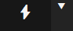
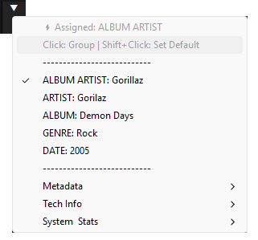

# ⚡ AUTOMETA
### Lightning-Fast Tag Grouper & Smart Playlist Generator for Foobar2000

**Autometa** is a minimalist, highly customizable JScript Panel script designed to organize your music library instantly. Create dynamic, autoplaying playlists based on any metadata tag with a single click.

## ✨ Features

* **Dual Visual Modes:**
    * **Minimalist:** A giant lightning bolt icon (⚡) for a clean, distraction-free look.
    * **Track Info:** Elegantly displays the current Artist & Title.
* **Instant Grouping:** Click the main button to instantly group your library by your favorite tag (Album Artist, Genre, Year, etc.).
* **Smart Context Menu:**
    * **Left Click (▽):** Browse and select specific tags to group by (Metadata, Tech Info, System Stats).
    * **Shift + Click:** Assign any tag from the menu as the new **Default Quick Action**.
* **Deep Customization:**
    * **Themes:** Choose between **Autometa Dark** (Default), **System** (Adapts to Foobar/Windows colors), or **Custom** (Define your own RGB values).
    * **Localization:** Native support for **English** and **Spanish** (Español).
    * **Behavior:** Toggle between "Autoplay" (play immediately) or "List Only" (browse without interrupting playback).
* **System Integration:** Works with both Default UI (DUI) and Columns UI (CUI).

## 🚀 Installation

1.  Install **Foobar2000**.
2.  Install the **Spider Monkey Panel** (or JScript Panel 3) component.
3.  Add a `JScript Panel` to your layout.
4.  Right-click the panel > **Configure**.
5.  Copy the full code from `autometa.js` and paste it into the editor window.
6.  Click **OK**.

## 🛠 Usage

| Zone | Action |
| :--- | :--- |
| **Main Area (\u26A1)** | **Execute Default:** Groups music by the assigned tag (Default: Album Artist). |
| **Arrow Button (\u25BC)** | **Open Menu:** Select a specific tag to group by one time. |
| **Shift + Menu Item** | **Assign Default:** Sets the selected tag as the new default for the Main Area. |
| **Right Click** | **Settings:** Change Appearance, Behavior, Language, and Themes. |

## 🎨 Custom Themes

Autometa supports custom coloring via the Properties menu.
1.  Right-click > **Properties**.
2.  Set **Theme Mode** to `2` (Custom).
3.  Edit the RGB values in text format (e.g., `255,0,0` for Red).

## 📋 Requirements

* **OS:** Windows 10 or 11 (Recommended for full Emoji support).
* **Component:** Spider Monkey Panel v1.6.1 or newer.
* **Fonts:** Segoe UI Emoji, Segoe UI Symbol.

## 📄 License

This project is licensed under the MIT License - feel free to modify and share!

---
*Developed with ❤️ for the Foobar2000 community.*
