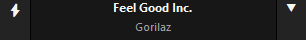

# ⚡ AUTOMETA

### Lightning-Fast Tag Grouper & Smart Playlist Generator for Foobar2000

**Autometa** is a minimalist, customizable JScript Panel script designed to quickly create autoplaylists based on the current track's tags with a single click (similar to the quick search function).

* Info Mode

* Minimalist Mode

## ✨ Features

* **Dual Visual Modes:**
    * **Minimalist:** A single button (⚡) for the selected quick action, fits anywhere.
    * **Track Info:** Displays the current Artist & Title. Clicking on it focuses on the currently playing track.
* **Instant Grouping:** Click the main button to instantly create an autoplaylist of the assigned tag from the currently playing song.
* **Multi-Value Tag Support:** Automatically detects tags containing multiple values (e.g., `Rock; Pop`) and provides a smart sub-menu letting you choose an individual value or the combined string.
* **Smart Context Menu:**
    * **(▽):** Browse and select specific tags to group by (Metadata, Tech Info, System Stats).
    * **Shift + Click:** Assign any tag from the menu as the new **Default Quick Action**.
* **Deep Customization:**
    * **Themes:** Dark (Default), System (matches your Foobar/OS colors), or Custom RGB.
    * **Behavior:** Toggle auto-playback on playlist creation.
    * **System Integration:** Works with both Default UI (DUI) and Columns UI (CUI).

* Menu Contents (Nested)

## 🚀 Installation

1.  Install **Foobar2000**.
2.  Install the **Spider Monkey Panel** (or JScript Panel 3) component.
3.  Add a `JScript Panel` to your layout.
4.  Right-click the panel > **Configure**.
5.  Load `autometa.js` as a package or paste its contents into the editor window.
6.  Click **OK**.

## 🛠 Usage

| Zone | Action |
| :--- | :--- |
| **Main Area (⚡)** | **Execute Default:** Groups music by the assigned tag (Default: Album Artist). |
| **Arrow Button (▽)** | **Open Menu:** Select a specific tag to group by one time. |
| **Shift + Menu Item** | **Assign Default:** Sets the selected tag as the new default for the Main Area. |
| **Multi-Value Tags** | If a tag contains multiple values separated by `; `, a smart pop-up will let you choose which specific value to group by. |
| **Right Click** | **Settings:** Change Appearance, Behavior, Language, and Themes. |

## 🎨 Custom Themes

Autometa supports custom coloring via the Properties menu.
1.  Right-click > **Properties**.
2.  Set **Theme Mode** to `2` (Custom).
3.  Edit the RGB values in text format (e.g., `255,0,0` for Red).

## 📋 Requirements
* Foobar2000 v1.4 or newer.
* Spider Monkey Panel OR JScript Panel 3

* **OS:** Windows 10 or 11 (Recommended for full Emoji support).
* **Fonts:** Segoe UI Emoji, Segoe UI Symbol.
***

## 📄 License

This project is licensed under the MIT License - feel free to modify and share!

---
*Made with 🤍 for the Foobar2000 community.*