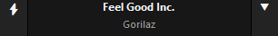
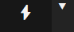
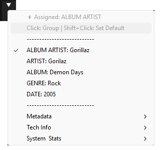

# ⚡ Autometa
   

**Autometa** is a minimalist, customizable JScript Panel script designed to quickly create autoplaylists based on the current track's tags with a single click (similar to the quick search function).

* Info Mode

* Minimalist Mode

## 📢 What's New (v1.2)

* **Built-in Updater:** Added a manual update checker to let you know when new versions are available directly from GitHub.
* **Dynamic Tooltips:** Hovering over the main button now displays exactly which tag is currently assigned as the default quick action.
* **Middle-Click Toggle:** You can now use the middle mouse button to instantly swap between Minimalist and Track Info display modes.
* **Alt + Click Modifier:** Hold `Alt` while clicking the main button to temporarily invert your Auto-Play setting on the fly without opening the menu.
* **Granular Custom Themes:** Expanded the custom color properties, allowing independent RGB values for Background, Main Text, Sub Text, Highlights, and Buttons.
* **Menu Restructuring & UI Fixes:** Reorganized the right-click options menu for a better workflow (e.g., Submenu settings are now grouped under Layout) and applied some UI alignment fixes.

  
# ✨ Features

* **Dual Visual Modes:**
    * **Minimalist:** A single button (⚡) for the selected quick action, fits anywhere.
    * **Track Info:** Displays the current Artist & Title. Clicking on it focuses on the currently playing track.
    * **Middle-Click Toggle:** Instantly swap between Minimalist and Track Info modes using the middle mouse button.
* **Instant Grouping:** Click the main button to instantly create an autoplaylist of the assigned tag from the currently playing song.
* **Multi-Value Tag Support:** Automatically detects tags containing multiple values (e.g., `Rock; Pop`) and provides a smart sub-menu letting you choose an individual value or the combined string.
* **Smart Context Menu:**
    * **(▽):** Browse and select specific tags to group by (Metadata, Tech Info, System Stats).
    * **Shift + Click:** Assign any tag from the menu as the new **Default Quick Action**.
    * **Alt + Click:** Temporarily invert your Auto-Play setting on the fly without opening the menu.
* **Deep Customization:**
    * **Themes:** Dark (Default), System (matches your Foobar/OS colors), or Custom RGB.
    * **Behavior:** Toggle auto-playback on playlist creation.
    * **System Integration:** Works with both Default UI (DUI) and Columns UI (CUI).
* **Built-in Updater:** Easily check for new versions directly from GitHub via the right-click menu.

* Menu Contents (Nested)

## 📋 Requirements

* Foobar2000 v1.4 or newer.
* Spider Monkey Panel OR JScript Panel 3.
* **OS:** Windows 10 or 11 (Recommended for full Emoji support).
* **Fonts:** Segoe UI Emoji, Segoe UI Symbol.

## 📥 Installation

1. Add a `JScript Panel` to your layout.
2. Right-click the panel > **Configure**.
3. Load `autometa.js` as a package or paste its contents into the editor window.
4. Click **OK**.

## 🛠️ Usage

| Zone / Action | Description |
| :--- | :--- |
| **Main Area (⚡)** | **Execute Default:** Groups music by the assigned tag (Default: Album Artist). Hover over it to see the currently assigned tag. |
| **Arrow Button (▽)** | **Open Menu:** Select a specific tag to group by one time. |
| **Middle Click** | **Toggle Layout:** Instantly switches between Minimalist and Track Info views. |
| **Shift + Menu Item** | **Assign Default:** Sets the selected tag as the new default for the Main Area. |
| **Alt + Click** | **Invert Auto-Play:** Temporarily toggles your Auto-Play setting for that single action without having to open the menu. |
| **Multi-Value Tags** | If a tag contains multiple values separated by `; `, a smart pop-up will let you choose which specific value to group by. |
| **Right Click** | **Settings:** Change Layout, Behavior, Language, Themes, and Check for Updates. |

## 🎨 Custom Themes

Autometa supports granular custom coloring.
1. Right-click the panel > **Theme** > **Custom**.
2. To define your own colors, right-click the panel again > **Properties**.
3. Edit the specific RGB values in text format (e.g., `255,0,0` for Red) across the different UI elements (Background, Text, Highlights, etc.).

*Note: Selecting "Custom" without editing any of the default RGB values will default to load an alternate palette (Dark Neon).*

## 🗺️ Roadmap

* **Single Playlist Mode:** A toggle to reuse a single "Autometa Search" playlist instead of spawning a new tab every time you click, keeping your UI clean.
* **Expanded Theming:** More themeable UI, potentially including more default presets and preset import and export.

---
*Made with 🤍 for the Foobar2000 community.*
