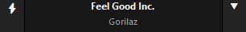
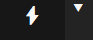
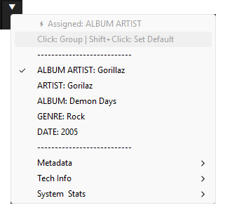

# ⚡ Autometa
   

**Autometa** is a minimalist JScript Panel designed to build autoplaylists based on the current track's tags with a single click.

* Info Mode

* Minimalist Mode

## 📢 What's New (v1.3)

* **Single Playlist Mode:** Reuse a dedicated "Autometa Search" playlist. Prevents playlist manager saturation during rapid navigation.
* **Theme Import & Export:** Share and load custom color schemes directly via clipboard using JSON format.
* **Granular Theming:** Expanded custom properties to 10 independent RGB variables. Control specific UI states, disabled buttons, and active text elements.
* **Smart Date Truncation:** Automatically extracts the 4-digit year from ISO date strings (e.g., 2020-03-26 becomes 2020) upon quick action assignment.
  
# ✨ Features

* **Instant Grouping:** Click the main button (⚡) to generate an autoplaylist of the assigned tag from the active track.
* **Single Playlist Mode:** Restrict generation to one reusable tab.
* **Multi-Value Tag Support:** Detects tags separated by `; `. Prompts a sub-menu to isolate a value or query the combined string.
* **Context Control:** Hold `Shift` while clicking a menu item to set it as the new default. Hold `Alt` over the main button to invert your auto-play rule temporarily.
* **Dual UI Modes:** Swap between Minimalist (icon only) and Track Info (Artist/Title display).
* **Deep Customization:** System color matching, dark mode, or full custom RGB mapping with JSON import/export.
* **Built-in Updater:** Check for version bumps directly from GitHub via the options menu.

* Menu Contents (Nested)

## 📋 Requirements

* Foobar2000 v1.4 or newer.
* Spider Monkey Panel OR JScript Panel 3.
* **OS:** Windows 10 or 11 (Recommended for full Emoji support).
* **Fonts:** Segoe UI Emoji, Segoe UI Symbol.

## 📥 Installation

1. Add a `JScript Panel` to your layout.
2. Right-click the panel > **Configure**.
3. Load `autometa.js` as a package or paste its contents into the editor window.
4. Click **OK**.

## 🛠️ Usage

* **⚡ Main Area (Action Zone)**
  * **Left-Click:** Execute default tag grouping.
  * **Alt + Left-Click:** Invert Auto-Play setting for this action.
  * *Hover:* Display active tag and status.
* **Track Info Area (Artist/Title text)**
  * **Left-Click:** Focus Foobar2000 on the currently playing track.
* **▽ Menu Button**
  * **Left-Click:** Open context menu for one-time tag grouping.
  * **Shift + Left-Click (on item):** Assign tag as the new default quick action.
* **Global Controls (Anywhere on panel)**
  * **Middle-Click:** Toggle between Minimalist and Track Info layouts.
  * **Right-Click:** Open Autometa settings (Layout, Behavior, Theme, Updates).

## 🎨 Custom Themes

Autometa let's you customize several RGB variables.
1. Right-click the panel > **Theme** > **Custom**.
2. Right-click the panel again > **Properties**.
3. Edit the RGB values in text format (e.g., `255,0,0` for Red).

To backup or load configurations, right-click the panel > **Theme** > **Import/Export Theme (Clipboard)**. The script parses standard JSON objects. Selecting "Custom" without editing values or importing a JSON will default to the Dark Neon palette.

## 🗺️ Roadmap

* **Custom Tag Bookmarks:** Allow manual input of non-standard tags or title formatting strings to pin them permanently to the quick actions, bypassing the active track metadata dependency.

---
*Made with 🤍 for the Foobar2000 community.*